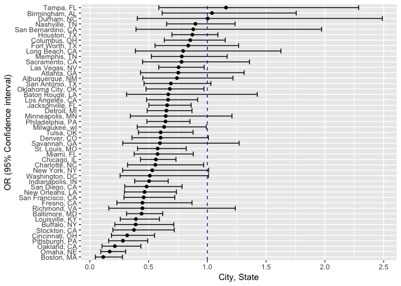
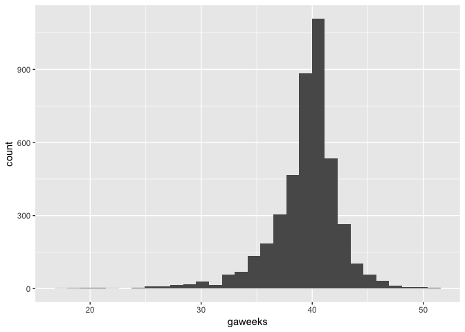
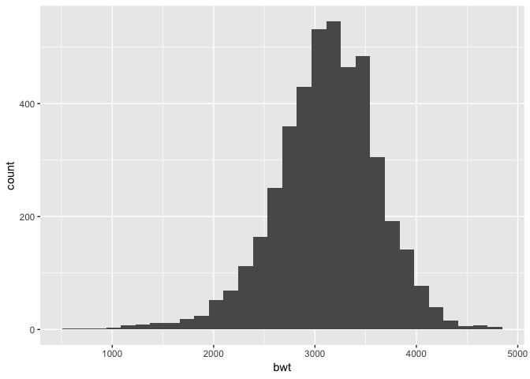
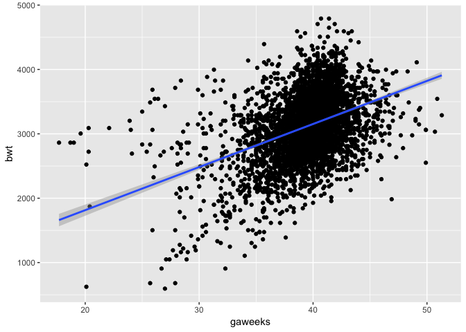
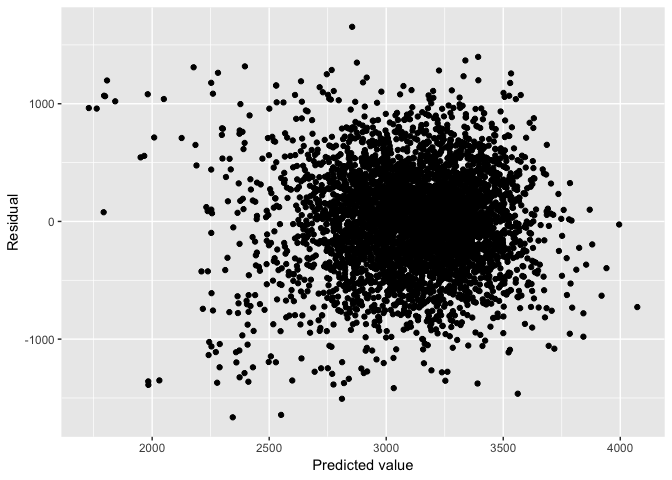
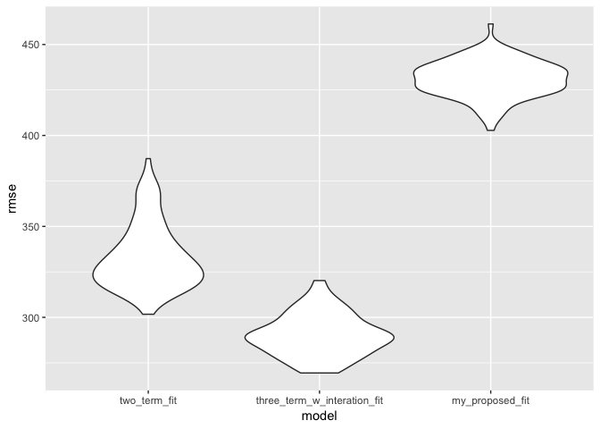

Homework 6
================
Amin Yakubu
11/24/2018

``` r
library(tidyverse)
```

    ## ── Attaching packages ───────────────────────────────────────────────────────────────────────────────────────────── tidyverse 1.2.1 ──

    ## ✔ ggplot2 3.1.0     ✔ purrr   0.2.5
    ## ✔ tibble  1.4.2     ✔ dplyr   0.7.8
    ## ✔ tidyr   0.8.1     ✔ stringr 1.3.1
    ## ✔ readr   1.1.1     ✔ forcats 0.3.0

    ## ── Conflicts ──────────────────────────────────────────────────────────────────────────────────────────────── tidyverse_conflicts() ──
    ## ✖ dplyr::filter() masks stats::filter()
    ## ✖ dplyr::lag()    masks stats::lag()

``` r
library(modelr)
```

### Problem 1

In the code chunk below, I am reading in the dataset and creating a city\_state variable (e.g. “Baltimore, MD”), and a binary variable indicating whether the homicide is solved. I will also remove Dallas, TX; Phoenix, AZ; and Kansas City, MO – these don’t report victim race and then Tulsa, AL – this is a data entry mistake.

I will then modify victim\_race to have categories white and non-white, with white as the reference category and make victim\_age numeric.

``` r
homicide_df = read_csv("https://raw.githubusercontent.com/washingtonpost/data-homicides/master/homicide-data.csv", col_names = TRUE) %>% 
  mutate(city_state = str_c(city, ",", " ", state),
         solved = if_else(disposition == "Closed by arrest", "resolved", "unresolved"),
         solved = fct_relevel(solved, "unresolved"),
         victim_race = tolower(victim_race),
         colpsd_victim_race = fct_collapse(victim_race, "non-white" = c("asian","black", "hispanic", "other", "unknown")),
         colpsd_victim_race = fct_relevel(colpsd_victim_race, "white"),
         victim_age = as.numeric(victim_age)) %>% 
  filter(!(city_state %in% c("Dallas, TX", "Phoenix, AZ", "Kansas City, MO", "Tulsa, AL")))
```

    ## Parsed with column specification:
    ## cols(
    ##   uid = col_character(),
    ##   reported_date = col_integer(),
    ##   victim_last = col_character(),
    ##   victim_first = col_character(),
    ##   victim_race = col_character(),
    ##   victim_age = col_character(),
    ##   victim_sex = col_character(),
    ##   city = col_character(),
    ##   state = col_character(),
    ##   lat = col_double(),
    ##   lon = col_double(),
    ##   disposition = col_character()
    ## )

    ## Warning in evalq(as.numeric(victim_age), <environment>): NAs introduced by
    ## coercion

For the city of Baltimore, MD, I will use glm function to fit a logistic regression with resolved vs unresolved as the outcome and victim age, sex and race as predictors. Subsequently, I will obtain the estimate and confidence interval of the adjusted odds ratio for solving homicides comparing non-white victims to white victims keeping all other variables fixed.

``` r
baltimore_df = homicide_df %>% 
  filter(city_state == "Baltimore, MD")

fit_logistic_baltimore = glm(solved ~ victim_age + victim_sex + colpsd_victim_race, data = baltimore_df, family = binomial())

fit_logistic_baltimore %>% broom::tidy() %>% 
  janitor::clean_names() %>% 
  mutate(OR = exp(estimate),
         lower_95_ci = exp(estimate - (1.96 * std_error)),
         upper_95_ci = exp(estimate + (1.96 * std_error))) %>% 
  filter(term == "colpsd_victim_racenon-white") %>% 
  select(OR, lower_95_ci, upper_95_ci) %>% 
  knitr::kable(digits = 3)
```

|     OR|  lower\_95\_ci|  upper\_95\_ci|
|------:|--------------:|--------------:|
|  0.441|          0.313|           0.62|

The odds of solving homicides comparing non-white victimes to white victims, adjusting for sex and age is 0.44 (95% CI: 0.31, 0.62).

Now, I will run `glm` for each of the cities in the dataset, each time extracting the adjusted odds ratio (and CI) for solving homicides comparing non-white victims to white victims.

``` r
fit_logistic_cities = homicide_df %>% 
  #Selecting only the variables needed
  select(city_state, solved, victim_age, victim_sex, colpsd_victim_race) %>%
  #Making listcolumns to use for the iteration
  group_by(city_state) %>% 
  nest() %>% 
  #Using maps to iterate the glm and tidy functions
  mutate(models = map(.x = data, ~ glm(solved ~ victim_sex + colpsd_victim_race + victim_age, 
                                      family = binomial, data = .x)),
         models = map(models, broom::tidy)) %>% 
  select(-data) %>% unnest() %>% 
  filter(term == "colpsd_victim_racenon-white") %>% 
  mutate(OR = exp(estimate),
  # Calculating the 95% confidence intervals
         lower_95_ci = exp(estimate - (1.96*std.error)),
         upper_95_ci = exp(estimate + (1.96*std.error))) %>% 
  select(city_state, OR, lower_95_ci, upper_95_ci) %>% 
  #Organizing cities according to estimated OR. From lowest to highest
  mutate(city_state = reorder(city_state, OR))
```

Creating a plot that shows the estimated ORs and CIs for each city.

``` r
ggplot(fit_logistic_cities, aes(x = city_state, y = OR )) + 
  geom_point() + 
  geom_errorbar(aes(ymin = lower_95_ci, ymax = upper_95_ci)) + 
  coord_flip() +
  geom_hline(aes(yintercept = 1.00), linetype = "dashed", color = "blue") + 
  labs(
    y = "OR (95% Confidence interval)",
    x = "City, State"
  )
```



We see that in almost all the cities ( expections, Tampa & Birmingham and Durham) have OR below 1.0. This means that in almost all of the cities, the odds of solving a homicide for non-white is less that white category, adjusting for sex and age. However, it is important to note the confidence intervals - about half include the value of 1, meaning they are not statistically significant.

### Problem 2

``` r
children_df = read_csv("./data/birthweight.csv") %>% 
  mutate(babysex = as.factor(babysex),
         frace = as.factor(frace),
         mrace = as.factor(mrace),
         malform = as.factor(malform))
```

    ## Parsed with column specification:
    ## cols(
    ##   .default = col_integer(),
    ##   gaweeks = col_double(),
    ##   ppbmi = col_double(),
    ##   smoken = col_double()
    ## )

    ## See spec(...) for full column specifications.

``` r
#checking to see if there are missing variables in any of the variables for the observations
filter_all(children_df, any_vars(is.na(.)))
```

    ## # A tibble: 0 x 20
    ## # ... with 20 variables: babysex <fct>, bhead <int>, blength <int>,
    ## #   bwt <int>, delwt <int>, fincome <int>, frace <fct>, gaweeks <dbl>,
    ## #   malform <fct>, menarche <int>, mheight <int>, momage <int>,
    ## #   mrace <fct>, parity <int>, pnumlbw <int>, pnumsga <int>, ppbmi <dbl>,
    ## #   ppwt <int>, smoken <dbl>, wtgain <int>

``` r
sum(is.na(homicide_df))
```

    ## [1] 635

There are no missing obervations for the variables.

Linear regression maybe appropriate, since the outcome of interest is continuous.

I am hypothesizing that gestational age in weeks is associated with baby's birthweight. Based on literature, I will adjust for baby's sex, mom's age, mom's race, mom's weight gain and average number of cigarettes smoked per day during pregnancy.

First, I will take a look at the distribution of the two variables.

``` r
ggplot(children_df, aes(x = gaweeks)) + geom_histogram()
```

    ## `stat_bin()` using `bins = 30`. Pick better value with `binwidth`.



``` r
ggplot(children_df, aes(x = bwt)) + geom_histogram()
```

    ## `stat_bin()` using `bins = 30`. Pick better value with `binwidth`.



``` r
ggplot(children_df, aes(x = gaweeks, y = bwt)) + geom_point() + geom_smooth(method = lm)
```



Gestational age in weeks appear to be slightly left skewed. Baby's birthweight appear to be normally distributed.

``` r
my_proposed_fit = lm(bwt ~ gaweeks + babysex + momage + mrace  + wtgain + smoken, data = children_df)

my_proposed_fit %>% 
  broom::tidy() 
```

    ## # A tibble: 9 x 5
    ##   term        estimate std.error statistic   p.value
    ##   <chr>          <dbl>     <dbl>     <dbl>     <dbl>
    ## 1 (Intercept)   868.      92.4        9.40 8.99e- 21
    ## 2 gaweeks        54.9      2.14      25.6  7.67e-135
    ## 3 babysex2      -86.0     13.1       -6.55 6.61e- 11
    ## 4 momage          4.82     1.83       2.63 8.51e-  3
    ## 5 mrace2       -276.      15.1      -18.3  5.92e- 72
    ## 6 mrace3       -199.      67.0       -2.97 3.00e-  3
    ## 7 mrace4       -168.      29.6       -5.68 1.42e-  8
    ## 8 wtgain          9.27     0.610     15.2  6.91e- 51
    ## 9 smoken        -11.4      0.916    -12.4  9.80e- 35

A plot of model residuals against fitted values – use add\_predictions and add\_residuals in making this plot.

``` r
children_df %>% 
  modelr::add_predictions(my_proposed_fit) %>% 
  modelr::add_residuals(my_proposed_fit) %>% 
  ggplot(aes(x = pred, y = resid)) + geom_point() +
  labs(x = "Predicted value", 
       y = "Residual")
```



#### Comparing 3 non-nested models

I will use cross validation methods to compare the three models below (2 below and one above)

``` r
two_term_fit = lm(bwt ~ blength + gaweeks, data = children_df)

three_term_w_interation_fit = lm(bwt ~ bhead * blength *babysex, data = children_df)
```

Cross validation

``` r
set.seed(1)

cv_df =
  crossv_mc(children_df, 100) %>% 
  mutate(train = map(train, as_tibble),
         test = map(test, as_tibble))
```

``` r
cross_validation = cv_df %>% 
  mutate(two_term_fit = map(train, ~ lm(bwt ~ blength + gaweeks, data = .x)),
         three_term_w_interation_fit = map(train, ~ lm(bwt ~ bhead * blength *babysex, data = .x)),
         my_proposed_fit = map(train, ~ lm(bwt ~ gaweeks + babysex + momage + mrace  + wtgain + smoken, data = .x))) %>% 
  mutate(rmse_two_term_fit = map2_dbl(two_term_fit, test, ~ rmse(model = .x, data = .y)),
         rmse_three_term_w_interation_fit = map2_dbl(three_term_w_interation_fit, test, ~ rmse(model = .x, data = .y)),
         rmse_my_proposed_fit = map2_dbl(my_proposed_fit, test, ~ rmse(model = .x, data = .y)))
```

``` r
cross_validation %>% 
  select(starts_with("rmse")) %>% 
  gather(key = model, value = rmse) %>% 
   mutate(model = str_replace(model, "rmse_", ""),
         model = fct_inorder(model)) %>% 
  ggplot(aes(x = model, y = rmse)) + geom_violin()
```



``` r
cross_validation %>% 
  select(starts_with("rmse")) %>% 
  gather(key = model, value = rmse) %>% 
  group_by(model) %>% 
  summarize(mean_rmse = mean(rmse)) %>% 
  arrange(mean_rmse) %>% 
  knitr::kable(digits = 3)
```

| model                                 |  mean\_rmse|
|:--------------------------------------|-----------:|
| rmse\_three\_term\_w\_interation\_fit |     290.156|
| rmse\_two\_term\_fit                  |     333.455|
| rmse\_my\_proposed\_fit               |     431.180|

Based on the graph and the averages, it is clear that the better model is the 3 term model with interactions.
