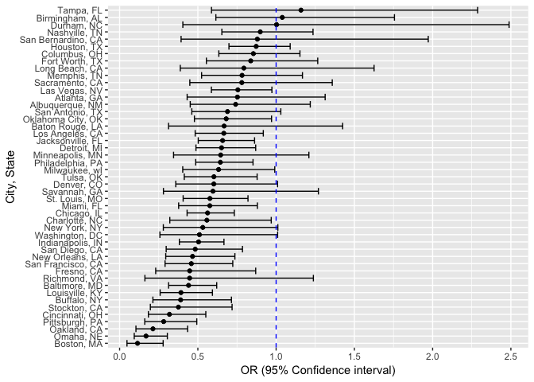

Homework 6
================
Amin Yakubu
11/24/2018

In the code chunk below, I am creating a city\_state variable (e.g. “Baltimore, MD”), and a binary variable indicating whether the homicide is solved. I will also remove Dallas, TX; Phoenix, AZ; and Kansas City, MO – these don’t report victim race and then Tulsa, AL – this is a data entry mistake.

I will then modify victim\_race to have categories white and non-white, with white as the reference category and make victim\_age numeric.

``` r
library(tidyverse)
```

    ## ── Attaching packages ─────────────────────────────────────────────────────────────────────────────────────────── tidyverse 1.2.1 ──

    ## ✔ ggplot2 3.1.0     ✔ purrr   0.2.5
    ## ✔ tibble  1.4.2     ✔ dplyr   0.7.8
    ## ✔ tidyr   0.8.1     ✔ stringr 1.3.1
    ## ✔ readr   1.1.1     ✔ forcats 0.3.0

    ## ── Conflicts ────────────────────────────────────────────────────────────────────────────────────────────── tidyverse_conflicts() ──
    ## ✖ dplyr::filter() masks stats::filter()
    ## ✖ dplyr::lag()    masks stats::lag()

``` r
homicide_df = read_csv("https://raw.githubusercontent.com/washingtonpost/data-homicides/master/homicide-data.csv", col_names = TRUE) %>% 
  mutate(city_state = str_c(city, ",", " ", state),
         solved = if_else(disposition == "Closed by arrest", "resolved", "unresolved"),
         solved = fct_relevel(solved, "unresolved"),
         victim_race = tolower(victim_race),
         colpsd_victim_race = fct_collapse(victim_race, "non-white" = c("asian","black", "hispanic", "other", "unknown")),
         colpsd_victim_race = fct_relevel(colpsd_victim_race, "white"),
         victim_age = as.numeric(victim_age)) %>% 
  filter(!(city_state %in% c("Dallas, TX", "Phoenix, AZ", "Kansas City, MO", "Tulsa, AL")))
```

    ## Parsed with column specification:
    ## cols(
    ##   uid = col_character(),
    ##   reported_date = col_integer(),
    ##   victim_last = col_character(),
    ##   victim_first = col_character(),
    ##   victim_race = col_character(),
    ##   victim_age = col_character(),
    ##   victim_sex = col_character(),
    ##   city = col_character(),
    ##   state = col_character(),
    ##   lat = col_double(),
    ##   lon = col_double(),
    ##   disposition = col_character()
    ## )

    ## Warning in evalq(as.numeric(victim_age), <environment>): NAs introduced by
    ## coercion

For the city of Baltimore, MD, I will use glm function to fit a logistic regression with resolved vs unresolved as the outcome and victim age, sex and race as predictors. Subsequently, I will obtain the estimate and confidence interval of the adjusted odds ratio for solving homicides comparing non-white victims to white victims keeping all other variables fixed.

``` r
baltimore_df = homicide_df %>% 
  filter(city_state == "Baltimore, MD")

fit_logistic_baltimore = glm(solved ~ victim_age + victim_sex + colpsd_victim_race, data = baltimore_df, family = binomial())

fit_logistic_baltimore %>% broom::tidy() %>% 
  janitor::clean_names() %>% 
  mutate(OR = exp(estimate),
         lower_95_ci = exp(estimate - (1.96 * std_error)),
         upper_95_ci = exp(estimate + (1.96 * std_error))) %>% 
  filter(term == "colpsd_victim_racenon-white") %>% 
  select(OR, lower_95_ci, upper_95_ci) %>% 
  knitr::kable(digits = 3)
```

|     OR|  lower\_95\_ci|  upper\_95\_ci|
|------:|--------------:|--------------:|
|  0.441|          0.313|           0.62|

The odds of solving homicides comparing non-white victimes to white victims, adjusting for sex and age is 0.44 (95% CI: 0.31, 0.62).

Now, I will run `glm` for each of the cities in the dataset, each time extracting the adjusted odds ratio (and CI) for solving homicides comparing non-white victims to white victims.

``` r
fit_logistic_cities = homicide_df %>% 
  #Selecting only the variables needed
  select(city_state, solved, victim_age, victim_sex, colpsd_victim_race) %>%
  #Making listcolumns to use for the iteration
  group_by(city_state) %>% 
  nest() %>% 
  #Using maps to iterate the glm and tidy functions
  mutate(models = map(.x = data, ~ glm(solved ~ victim_sex + colpsd_victim_race + victim_age, 
                                      family = binomial, data = .x)),
         models = map(models, broom::tidy)) %>% 
  select(-data) %>% unnest() %>% 
  filter(term == "colpsd_victim_racenon-white") %>% 
  mutate(OR = exp(estimate),
  # Calculating the 95% confidence intervals
         lower_95_ci = exp(estimate - (1.96*std.error)),
         upper_95_ci = exp(estimate + (1.96*std.error))) %>% 
  select(city_state, OR, lower_95_ci, upper_95_ci) %>% 
  #Organizing cities according to estimated OR. From lowest to highest
  mutate(city_state = reorder(city_state, OR))
```

Creating a plot that shows the estimated ORs and CIs for each city.

``` r
ggplot(fit_logistic_cities, aes(x = city_state, y = OR )) + 
  geom_point() + 
  geom_errorbar(aes(ymin = lower_95_ci, ymax = upper_95_ci)) + 
  coord_flip() +
  geom_hline(aes(yintercept = 1.00), linetype = "dashed", color = "blue") + 
  labs(
    x = "OR (95% Confidence interval)",
    y = "City, State"
  )
```



We see that in almost all the cities ( expections, Tampa & Birmingham and Durham) have OR below 1.0. This means that in almost all of the cities, the odds of solving a homicide for non-white is less that white category, adjusting for sex and age. However, it is important to note the confidence intervals - about half include the value of 1, meaning they are not statistically significant.
